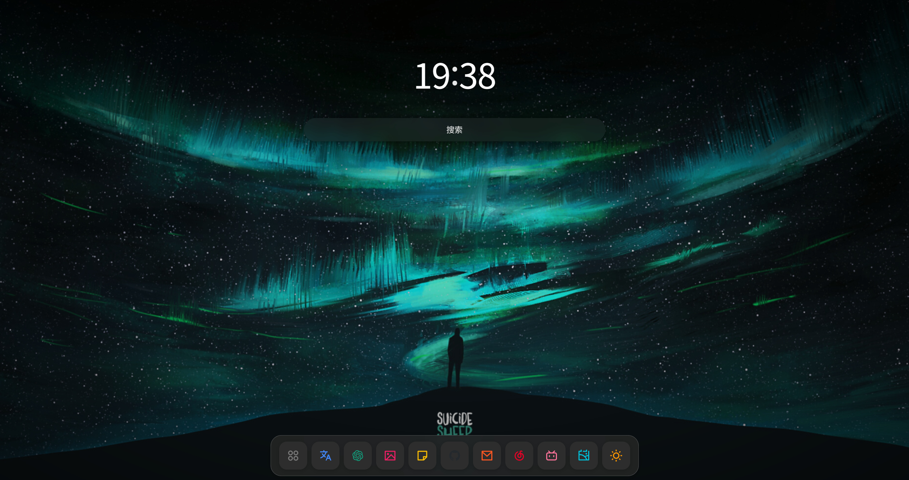

# Aurora 起始页

<div align="center">



一个简洁、美观、可定制的浏览器起始页扩展。

[](https://github.com/Aurorp1g/Aurora-newtab/releases)
[](LICENSE)
[]()
[]()

</div>

---

## ✨ 功能特点

| 功能 | 描述 |
|------|------|
| 🕐 **实时时钟** | 大字体显示当前时间，支持 12/24 小时制 |
| 🔍 **多搜索引擎** | 支持 Google、Bing、百度、DuckDuckGo、GitHub |
| 📱 **应用快捷方式** | 自定义添加常用网站，支持拖拽排序 |
| 🖼️ **壁纸系统** | 支持本地上传、在线图片、Bing 每日壁纸 |
| 🌓 **主题切换** | 浅色/深色/跟随系统 |
| 🔖 **书签集成** | 快速导入浏览器书签 |
| 🌐 **跨浏览器** | 支持 Chrome、Firefox、Edge |

---

## 🚀 快速开始

### 安装依赖

```bash
pnpm install
```

### 开发模式

```bash
# Chrome
pnpm dev

# Firefox
pnpm dev:firefox
```

### 构建

```bash
# Chrome
pnpm build

# Firefox
pnpm build:firefox

# 全部
pnpm build:all
```

### 打包发布

```bash
pnpm package
```

---

## 📦 安装扩展

### Chrome / Edge

1. 打开 `chrome://extensions/` (Chrome) 或 `edge://extensions/` (Edge)
2. 启用「开发者模式」
3. 点击「加载已解压的扩展程序」
4. 选择 `dist/chrome` 目录

### Firefox

1. 打开 `about:debugging#/runtime/this-firefox`
2. 点击「临时载入附加组件」
3. 选择 `dist/firefox/manifest.json`

---

## 🛠️ 技术栈

<div align="center">

| 技术 | 用途 |
|------|------|
| Vue 3 + TypeScript | 前端框架 |
| Vite | 构建工具 |
| TailwindCSS | 样式框架 |
| Pinia | 状态管理 |
| Iconify | 图标库 |

</div>

---

## 📂 项目结构

```
Aurora-newtab/
├── src/
│   ├── newtab/              # 新标签页应用
│   │   ├── App.vue
│   │   ├── main.ts
│   │   ├── components/      # UI 组件
│   │   └── composables/     # 组合式函数
│   ├── stores/              # Pinia stores
│   ├── types/                # TypeScript 类型
│   ├── styles/               # 全局样式
│   └── utils/                # 工具函数
├── icons/                    # 扩展图标
├── scripts/                  # 构建脚本
├── public/                   # 静态资源
├── manifest.json             # 扩展清单
├── vite.config.ts
├── tailwind.config.ts
└── package.json
```

---

## 🎨 自定义图标

应用使用 [Iconify](https://iconify.design/) 图标库，默认使用 [Remix Design](https://remixicon.com/) 图标集。

图标格式：`ri:icon-name`

---

## 📄 许可证

本项目基于 [MIT](LICENSE) 许可证开源。

---

<div align="center">

**如果对你有帮助，请点个 ⭐ Star 支持一下！**

</div>